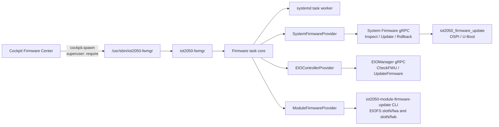

# Firmware Center

The Firmware Center integrates system, EIO controller, and EIO module firmware
operations into one Cockpit page. It deliberately keeps the three update
domains separate: they share transport, task persistence, and presentation,
but not package formats or flashing logic.

## Components

| Component | Location | Responsibility |
| --- | --- | --- |
| Cockpit package | `/usr/share/cockpit/iot2050-firmware` | File selection, inspection results, confirmation, and task status |
| Backend | `/usr/sbin/iot2050-fwmgr` | Fixed operation dispatch, provider discovery, staging, and task persistence |
| Task worker | `iot2050-firmware-task@.service` | Runs one persistent firmware task outside the Cockpit request process |
| System Firmware service | `/run/iot2050/system-firmware.sock` | Root-only gRPC service for System Firmware operations |
| SM providers | `iot2050-firmware-provider-sm` | Controller and module adapters installed only with SM support |

No HTTP firmware API or additional listening network port is introduced.
Cockpit invokes the local client through its existing privilege boundary.

## Invocation flow

All firmware domains use the same privileged control path:

The browser only calls the local `iot2050-fwmgr` backend. The backend validates
the fixed JSON command contract and passes the request to the firmware task
core. Inspection is handled in the request process; a write creates a durable
task and starts one systemd worker. The worker invokes the selected provider,
which then uses the domain-specific firmware backend. System Firmware uses its
root-only gRPC service, while the SM controller provider uses the existing
EIOManager service. The result follows the same path back to the Cockpit page.

The page shows the device identity as `Name`, `MLFB`, and `SN`. System Firmware
also shows the OS image version, current firmware version, and expected package
version. Firmware versions are normalized to the `V...` label; a build prefix
such as `2026.07-` is not shown. System Firmware and EIO controller cards show
`Matched` or `Unmatched` by comparing the current and expected versions. The
Module Firmware card is hidden when no scanned slot has a valid `fwa` or `fwb`
node.

This common path is intentional: System Firmware, EIO controller firmware,
and EIO module firmware have different flashing implementations, but share
the same local privilege boundary, operation lifecycle, runtime availability
checks, progress reporting, and user-facing result format.

EIO Controller inspection and updates use the existing EIOManager gRPC service.
The legacy `CheckFWU` status values remain unchanged, while its message carries
the structured inspection result required by the Firmware Center. Module
Firmware continues to use its existing backend because the current EIO gRPC
contract does not represent module slots and chip A/B results.
Module updates use the existing fixed module firmware CLI with machine-readable
output; the CLI and its backend share the EIO resource lock.

## Runtime model

The protocol version is `1`. Each request and response occupies one JSON line.
The currently supported operations are:

- `capabilities.list`: list providers supported by this hardware and their
  current runtime availability.
- `staging.import`: copy a local file into private manager storage and return a
  token, size, name, and SHA-256 digest.
- `inspect.get`: perform provider-specific checks without writing hardware.
- `action.start`: start one persistent hardware task.
- `task.get`: retrieve the durable task state.
- `action.rollback`: restore the shared local System Firmware backup.
- `staging.list`, `staging.delete`, `staging.gc`: operator maintenance of uploaded artifacts.

The backend accepts one task at a time, while the backend resource locks also
protect direct CLI and service entry points. System Firmware uses a separate
resource from EIO Controller and Module; the two EIO operations share one
resource. A competing operation is rejected with `firmware-busy`. Tasks
transition through `running` and `succeeded` or `failed`. A task left in
`running` after its systemd worker disappears is marked `failed/interrupted`;
automatic flash resume is intentionally not attempted.

Provider descriptors in `providers.d` isolate optional hardware support. A bad
optional descriptor is logged and skipped instead of disabling the System
Firmware provider.

SM providers remain visible on an SM device when EIOFS is unavailable. In that
case the Firmware Center displays the provider's availability reason and
disables its inspection, upload, and update controls. Provider availability is
checked again by the manager before every inspection or hardware operation.

When EIOFS is available, the Module provider scans slots `1..6` at runtime and
reports the slots and `fwa`/`fwb` nodes that actually exist. The Firmware
Center uses this scan to populate the slot selector and disable updates for
missing chip nodes. If an external EIO controller update fails, the UI does
not reboot automatically; it asks the operator to keep power connected, reboot
manually to reinitialize the controller, then refresh and inspect before
retrying.

## Security boundaries

### Staging

The backend copies input through an `O_NOFOLLOW` file descriptor, accepts only
regular files, enforces a size limit, and stores data and metadata under a
root-only directory. `resolve()` recomputes size and SHA-256 before every
inspection or update so that a modified staged object is rejected.

Tokens are capabilities for files already inside backend-controlled storage;
providers never accept arbitrary paths from Cockpit.

Staged artifacts are claimed by their task before a worker starts. Successful
tasks consume their uploads; failed tasks release them for diagnostics and the
hourly systemd GC removes unclaimed artifacts older than 24 hours. The GC never
traverses the task store or the System rollback store.

### System Firmware

Managed System Firmware updates have stricter behavior than the legacy CLI:

- A signature is mandatory and is verified during inspection and again before
  flashing.
- The package is extracted into a private temporary directory.
- Only flat regular-file tar members are accepted. Absolute paths, parent
  traversal, directories, symbolic links, hard links, and device nodes are
  rejected.
- Member count and total extracted size are bounded.
- System Firmware operations run in the root-owned service with `HOME=/root`,
  so all clients use one process-owned rollback location.
- CLI and backend use the same process-home backup file at
  `${HOME}/.rollback_fw/rollback_backup_fw.tar`. An explicit CLI
  `--backup-dir` remains a compatibility override.
- Web rollback uses that local backup and verifies its SHA-256 metadata before
  reusing the existing CLI rollback flashing semantics.
- The managed path never prompts, retries a failed flash, or reboots.
- The page warns before every hardware write that an interrupted update may
  leave the device unbootable, and tells the operator not to power off or reset
  the device during the operation.
- A failed System Firmware update is followed by rollback-backup inspection.
  When a verified backup exists, the page offers an explicit rollback action;
  when no backup is available, the page tells the operator to keep the device
  powered and follow the recovery procedure.
- Controller and Module providers do not expose a generic rollback operation;
  failures therefore require keeping the device powered and following the
  provider-specific recovery procedure.

The CLI remains backward compatible: `--verify` is still optional there, and
its existing arguments and numeric return codes remain stable. New code must
not implement the Web path by calling the CLI `main()` because that would
inherit interactive confirmation and blind retry behavior.

The backend and its systemd task worker run as root. Product administrators use
Cockpit's `superuser: require` flow backed by their `sudo` membership; no
direct firmware socket is exposed to product users.

### SM-only providers

SM provider packaging is controlled by `IOT2050_SM_SUPPORT`. At runtime, the
device-tree compatible string is the hardware identity boundary and EIOFS
nodes prove service readiness. Hiding a card in the browser is not treated as
authorization; provider availability is checked again in the manager.

`firmware_a` and `firmware_b` refer to chip A and chip B inside a module. They
are not redundant banks. Module slots are validated as `1..6` by the backend.

## Provider contracts

### System

The default source is the packaged tarball matching
`/usr/share/iot2050/fwu/IOT2050-FW-Update-PKG-*.tar.xz`. The page also accepts
a custom uploaded signed tar package. Both sources go through the same backend
compatibility and signature checks; the browser never decides whether the
package is valid. Inspection returns the selected firmware name, target version
and board, firmware SHA-256, and signature status. The System update
confirmation always uses this inspection result. Update always backs up and
reports that a reboot is required.

### EIO controller

Source: image-default firmware only. Inspection reports runtime and bundled
versions, metadata SHA-1, actual SHA-256, update need, and integrity. The
current controller format is not signature-verified; the UI must display the
hash before confirmation and the provider performs readback after flashing.

### Module

Source: independently staged chip A and/or chip B images. Updates preserve the
existing CLI order (A then B) and report per-chip outcomes. A successful A
write followed by a failed B write remains a partial update and must not be
reported as an atomic rollback.

## Maintenance

When adding a provider:

1. Keep domain-specific validation and flashing in its existing package.
2. Implement `available()`, `capabilities()`, and `inspect()`; add `start()` only
   when writing is supported.
3. Consume staging tokens rather than caller paths.
4. Return stable `ManagerError` codes and avoid exposing tracebacks or private
   paths through IPC.
5. Verify the resulting Debian package. Recipe metadata and package builds
  should be run through `kas-container` so `/repo` and Isar paths match the
  supported build environment.

Hardware writes require separate on-device validation. In particular, test
power-loss handling, backup readability, flash readback, EIOFS readiness, and
post-update reboot behavior on representative Basic, Advanced, and SM boards.

After a successful update or rollback, the page offers an explicit, second
confirmed `systemctl reboot` action. Reboot is never an automatic side effect
of a firmware request. Running or flashing tasks are deliberately not
interruptible.
